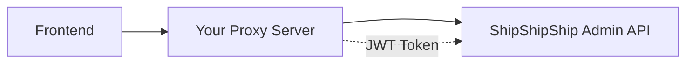
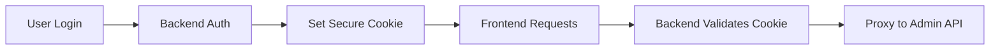
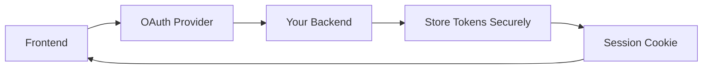

# Security Guide for ShipShipShip Template

This guide explains how to securely implement authentication for your ShipShipShip changelog template when connecting to external admin backends.

## ⚠️ Critical Security Issue: Client-Side JWT Tokens

**NEVER** expose JWT tokens in frontend environment variables. Here's why:

```javascript
// ❌ DANGEROUS - This token is visible to everyone!
const token = import.meta.env.VITE_JWT_TOKEN; // Compiled into JavaScript bundle
```

When you use `VITE_*` environment variables, they are:
- Compiled directly into your JavaScript bundle
- Visible in browser developer tools
- Accessible to any user visiting your site
- Stored in plain text in your built files

## 🛡️ Secure Authentication Solutions

### Option 1: Server-Side Proxy (Recommended)

Create a backend service that acts as a secure proxy:



#### Implementation Example

**Backend Proxy (Node.js/Express):**
```javascript
// server.js
const express = require('express');
const axios = require('axios');
const app = express();

const ADMIN_API_URL = process.env.ADMIN_API_URL;
const JWT_TOKEN = process.env.JWT_TOKEN; // Secure server-side storage

// Proxy all API requests
app.use('/api/*', async (req, res) => {
  try {
    const response = await axios({
      method: req.method,
      url: `${ADMIN_API_URL}${req.path}`,
      headers: {
        'Authorization': `Bearer ${JWT_TOKEN}`, // Added server-side
        'Content-Type': 'application/json',
      },
      data: req.body,
    });
    
    res.json(response.data);
  } catch (error) {
    res.status(error.response?.status || 500).json({
      error: error.response?.data?.error || 'Proxy error'
    });
  }
});

app.listen(3000);
```

**Environment Variables (Server-side only):**
```bash
# Server environment - NOT exposed to frontend
ADMIN_API_URL=https://admin-api.example.com
JWT_TOKEN=eyJhbGciOiJIUzI1NiIsInR5cCI6IkpXVCJ9...
```

**Frontend Configuration:**
```bash
# Frontend can safely point to your proxy
VITE_ADMIN_API_URL=https://your-proxy-server.com
# No JWT token needed in frontend!
```

### Option 2: Session-Based Authentication

Implement a proper login flow with secure cookies:



#### Implementation Example

**Backend Authentication:**
```javascript
// auth.js
const session = require('express-session');

app.use(session({
  secret: process.env.SESSION_SECRET,
  httpOnly: true,      // Prevents XSS access
  secure: true,        // HTTPS only
  sameSite: 'strict',  // CSRF protection
  maxAge: 24 * 60 * 60 * 1000 // 24 hours
}));

// Login endpoint
app.post('/auth/login', async (req, res) => {
  const { username, password } = req.body;
  
  // Validate credentials against your auth system
  if (await validateCredentials(username, password)) {
    req.session.authenticated = true;
    req.session.userId = userId;
    res.json({ success: true });
  } else {
    res.status(401).json({ error: 'Invalid credentials' });
  }
});

// Protected proxy middleware
function requireAuth(req, res, next) {
  if (!req.session.authenticated) {
    return res.status(401).json({ error: 'Authentication required' });
  }
  next();
}

// Protected API proxy
app.use('/api/*', requireAuth, async (req, res) => {
  // Proxy with server-side JWT
  // (same as Option 1)
});
```

**Frontend Login:**
```javascript
// login.js
async function login(username, password) {
  const response = await fetch('/auth/login', {
    method: 'POST',
    headers: { 'Content-Type': 'application/json' },
    body: JSON.stringify({ username, password }),
    credentials: 'include' // Include cookies
  });
  
  if (response.ok) {
    // Redirect to main app
    window.location.href = '/';
  }
}
```

### Option 3: OAuth Flow

Use OAuth providers (Google, GitHub, etc.) for authentication:



#### Implementation Example

**Backend OAuth:**
```javascript
// oauth.js
const passport = require('passport');
const GoogleStrategy = require('passport-google-oauth20');

passport.use(new GoogleStrategy({
  clientID: process.env.GOOGLE_CLIENT_ID,
  clientSecret: process.env.GOOGLE_CLIENT_SECRET,
  callbackURL: "/auth/google/callback"
}, async (accessToken, refreshToken, profile, done) => {
  // Store user info and tokens securely in database
  const user = await createOrUpdateUser(profile, {
    accessToken,    // Stored server-side only
    refreshToken
  });
  return done(null, user);
}));

app.get('/auth/google', 
  passport.authenticate('google', { scope: ['profile', 'email'] }));

app.get('/auth/google/callback',
  passport.authenticate('google', { failureRedirect: '/login' }),
  (req, res) => {
    res.redirect('/');
  });
```

## 🔒 Security Best Practices

### 1. Environment Variable Security

```bash
# ✅ Server-side only (secure)
JWT_TOKEN=eyJhbGciOiJIUzI1NiIs...
DATABASE_PASSWORD=secret123
API_SECRET_KEY=super-secret

# ✅ Frontend (safe to expose)
VITE_API_URL=https://api.example.com
VITE_APP_VERSION=1.0.0
VITE_PUBLIC_KEY=pk_live_123

# ❌ NEVER do this
VITE_JWT_TOKEN=eyJhbGciOiJIUzI1NiIs...  # Exposed to all users!
VITE_SECRET_KEY=secret123                # Visible in browser!
```

### 2. HTTPS Everywhere

```javascript
// ✅ Always use HTTPS for external APIs
const API_URL = 'https://secure-api.example.com';

// ❌ Never use HTTP for sensitive data
const API_URL = 'http://insecure-api.example.com';
```

### 3. CORS Configuration

```javascript
// Backend CORS setup
app.use(cors({
  origin: ['https://your-frontend.com'],  // Specific origins only
  credentials: true,                      // Allow cookies
  optionsSuccessStatus: 200
}));
```

### 4. Error Handling

```javascript
// ✅ Don't expose internal errors
try {
  const result = await adminAPI.call();
  res.json(result);
} catch (error) {
  console.error('Internal error:', error); // Log server-side
  res.status(500).json({ 
    error: 'Service temporarily unavailable' // Generic client error
  });
}
```

## 🚀 Deployment Security

### Docker Secrets

```dockerfile
# Use Docker secrets for sensitive data
COPY --from=secrets,source=jwt_token,target=/run/secrets/jwt_token

# Read in application
const JWT_TOKEN = fs.readFileSync('/run/secrets/jwt_token', 'utf8');
```

### Environment-Specific Configs

```bash
# Production
ADMIN_API_URL=https://prod-admin.example.com
JWT_TOKEN=${PROD_JWT_TOKEN}  # From secure vault

# Staging  
ADMIN_API_URL=https://staging-admin.example.com
JWT_TOKEN=${STAGING_JWT_TOKEN}

# Development (local only)
ADMIN_API_URL=http://localhost:8080
JWT_TOKEN=dev-token-safe-for-local-only
```

## ✅ Security Checklist

- [ ] No JWT tokens in frontend environment variables
- [ ] All sensitive data handled server-side
- [ ] HTTPS used for all external communications
- [ ] Proper CORS configuration
- [ ] Secure session management (if applicable)
- [ ] Error messages don't expose internal details
- [ ] Rate limiting implemented
- [ ] Input validation on all endpoints
- [ ] Security headers configured
- [ ] Regular security audits performed

## 🆘 If You've Already Exposed Tokens

If you've accidentally committed JWT tokens to your repository:

1. **Immediately revoke/rotate** the exposed tokens
2. **Remove tokens** from your codebase
3. **Force push** to remove from Git history (if possible)
4. **Audit access logs** for potential unauthorized usage
5. **Implement proper security** before redeploying

```bash
# Remove sensitive data from Git history
git filter-branch --force --index-filter \
  'git rm --cached --ignore-unmatch .env' \
  --prune-empty --tag-name-filter cat -- --all
```

Remember: **Security is not optional**. Always assume that anything in your frontend code is public information.